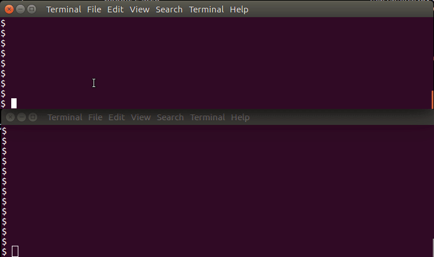

# proxy
Web forward proxy (HTTP/HTTPS)

Sample usage:


Sample code:
```
const proxyPort = 3128
const proxy = new Proxy(proxyPort)
proxy.start()
.then(()=>{
  // Use it for a while....
})
.then(() => proxy.stop())
```
